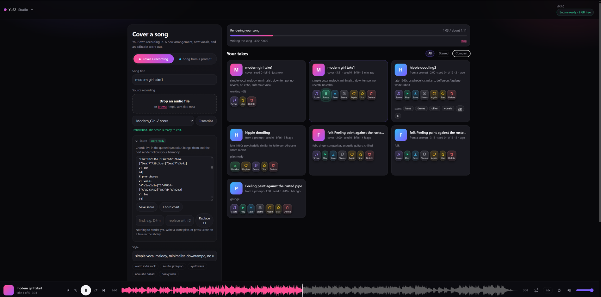

# YuE2 Studio

A web interface for [YuE2](https://github.com/multimodal-art-projection/YuE), the open music
model. Write a song from a prompt, or cover your own recording. Edit the score either way,
then pull the stems out of the result.

Everything runs in two containers on one machine. No cloud, no API keys, no accounts.

    browser  ->  app  (this project)                 http://localhost:8090
                   |
                   v
                 engine  (ComfyUI + the YuE2 nodes)  owns the GPU

## What it looks like

Covering a recording, with the score editor open and a render running:

[](https://raw.githubusercontent.com/dynamohum/YuE2gen-studio/master/docs/screenshots/full/cover-a-recording.png)

The same library in the compact layout:

[](https://raw.githubusercontent.com/dynamohum/YuE2gen-studio/master/docs/screenshots/full/compact-layout.png)

Writing a song from a prompt:

[](https://raw.githubusercontent.com/dynamohum/YuE2gen-studio/master/docs/screenshots/full/write-a-song.png)

Writing an instrumental, with the structure built section by section:

[](https://raw.githubusercontent.com/dynamohum/YuE2gen-studio/master/docs/screenshots/full/instrumental.png)

An identity: one singer's songs, analysed and ready to train a voice on:

[](https://raw.githubusercontent.com/dynamohum/YuE2gen-studio/master/docs/screenshots/full/identities.png)

## What it does

- **Cover a recording.** Upload a song, transcribe it once, edit the melody and chords, render.
  The transcription is cached per recording, so re-rendering skips straight to the music.
- **Song from a prompt.** Write a score plan from style and lyrics, read it, repair it, render it.
  A new plan costs seconds, so a bad melody is cheap to discard.
- **Choose how adventurous the chords are.** YuE2 tends to write one four-chord loop for a whole
  song. The Harmony slider, from Familiar to Outside, pushes the planner towards chords it has not
  just used, without breaking the song's structure.
- **Instrumentals.** A third mode: style and structure in, a song with no vocal out. Build the
  structure section by section, time each section, or let YuE2 decide.
- **Draft lyrics from a sentence.** Say what the song is about and pick a structure. Gemma 4
  writes a first draft in YuE2's section layout, on the same engine.
- **Choose the interpretation.** Six ways to render the same score, from Tight to Wide, and
  **Variations** renders one take in the others, so you can compare them by ear.
- **Choose the voice.** Chips set female, male or duet and a voice character. YuE2 has no vocal
  parameter, so the chips write into the style text, and the take keeps the choice.
- **Read the score three ways.** Expand opens a full size editor, with the chord find and replace
  beside it, and three views below: a chord chart, real staff notation, and the lyrics with each
  section's chords. Chord symbols sit in double quotes. Fix one everywhere with find and
  replace, or vary the harmony of a single section.
- **Stems.** Extract vocals, drums, bass, other, and optionally guitar and piano, on CPU, while
  the GPU stays free. Download them singly or as a zip.
- **Spaces.** Keep takes apart by project: a space per song, per album, or for sketches. Create,
  rename and delete spaces, and move a take from one to another.
- **A library.** Every take keeps its score, style, lyrics, seed and settings, so it can be
  reproduced, reworked, starred or deleted.
- **A player for reviewing takes.** A real waveform you can click to seek, previous and next through
  the library, ten second skips, repeat, speed and volume, with keyboard shortcuts.

## Requirements

- An NVIDIA GPU with 12 GB of VRAM or more is recommended, with 16 GB of system RAM. An 8 GB card
  is worth trying: ComfyUI moves what does not fit into system RAM, so it still works, though
  smaller cards are usually slower chips and renders take longer.
- Docker with the NVIDIA container toolkit, so containers can see the GPU.
- About 35 GB of disk: 15 GB of images, 17 GB of models, and room for your songs.
- Linux, or Windows with WSL2 or Docker Desktop. WSL2 is what this was built on; Windows with
  Docker Desktop needs a few settings, below.

## Quick start

```sh
git clone https://github.com/dynamohum/YuE2gen-studio.git
cd YuE2gen-studio
sh scripts/fetch-models.sh          # about 17 GB, and creates the folders below
docker compose up -d --build
```

Then open <http://localhost:8090>.

The fetch script also creates `data/` and `engine-state/output/`. Let it, rather than leaving them
to Docker: a folder Docker creates for a mount belongs to root, and the app, which runs as uid
1000, then cannot write its library there. If your user is not uid 1000, change `user:` for the
app in compose.yml to your `id -u`:`id -g`, or `chown` those two folders to 1000.

The models are YuE2 (plans and renders), SheetSage2 (transcription), Gemma 4 E4B (lyric drafts),
the YuE2 instrumental LoRA, and the Realaudio decoder LoRA and tokenizer head.

Only localhost is published, and **there is no login**: anyone who can reach the port can use the
app. To reach it from other machines, put it behind something that authenticates, and add the
name or address you use to `ALLOWED_HOSTS` in compose.yml, or the app refuses the request. See
Other ways to run it below.

### Windows with Docker Desktop

Docker Desktop runs the containers in the same WSL2 Linux system as WSL itself, so the app runs
the same way. The setup around it needs care:

1. **Use the WSL 2 engine.** In Docker Desktop, *Settings → General → Use the WSL 2 based engine*
   must be on. The older Hyper-V engine cannot reach the GPU.
2. **Turn on WSL integration** for your distribution, in *Settings → Resources → WSL
   Integration*, then open a new terminal. Without it, `docker` in a WSL terminal cannot see
   Desktop's daemon. If Docker is also installed inside WSL, `docker info --format
   '{{.OperatingSystem}}'` says which one you are talking to: Docker Desktop names itself, the
   other names the distribution.
3. **Install a current NVIDIA driver** for Windows. It includes WSL support; nothing is installed
   inside Linux. Check with `docker run --rm --gpus all nvidia/cuda:12.8.0-base-ubuntu24.04 nvidia-smi`,
   which should print the card.
4. **Give WSL enough memory.** It is capped at part of the PC's RAM, and a render needs about
   11 GB. Create `%UserProfile%\.wslconfig` with:

   ```ini
   [wsl2]
   memory=14GB
   ```

   Set it to your RAM less 2 GB, then run `wsl --shutdown` and start Docker Desktop again.
5. **Clone inside WSL, not on C:.** Open a WSL terminal (Ubuntu from the Store is the usual one)
   and run the quick start there. A clone on `C:\` works, but the 17 GB of models and the library
   then cross a slow bridge into Linux, and SQLite's locking is less dependable across it.
6. **Run the fetch script in that WSL terminal**, or in Git Bash. PowerShell and Command Prompt
   cannot run `sh`.

The repository forces Unix line endings, so a clone on Windows keeps its scripts runnable. If
`sh scripts/fetch-models.sh` still reports `$'\r': command not found`, the clone was made with a
setting that overrides it: clone again from the WSL terminal.

## Updating

```sh
git pull
docker compose up -d --build
```

The database migrates itself on the first start. Read the release notes for anything to do by
hand, such as a new setting in `compose.yml`.

## Using it

The **[user guide](app/static/guide.md)** covers everything the app does, organised by what you are
trying to do: writing a song, covering a recording, instrumentals, voices and Identities, style
LoRAs, stems, the library and what to do when something is wrong.

It is also in the app itself, under the menu in the top left, or at
<http://localhost:8090/guide> — which is where it is most useful, since trigger words and LoRA
strengths are things you need while filling the form.

## Settings

Press **YuE2 Studio** in the top left. The settings are stored on the server, so they follow you to
any browser and survive a rebuild.

| Setting | What it does |
|---|---|
| Stem audio format | WAV, FLAC, or MP3 at 320 kbps. The default for a new run; the sheet can still choose another |
| Stem separation model | Which model a run starts with |
| Stem save folder | Where stems are written. It must sit inside the data folder |

A settings sheet is generated from a specification on the server, so a new setting is a
server-side change only.

## Things worth knowing about YuE2

- **Both nodes must be on `full` mode to keep a chord progression.** SheetSage2's `melody` mode
  strips chord symbols, and YuE2 then invents its own harmony. `melody` is only better when you
  want the accompaniment to follow a new style freely.
- **Bracket tags in the lyrics box steer the model and are not sung.** `[Genre: ...]` and
  `[Chorus: bigger]` go into the conditioning. Measured: adding `[Genre: Indie Folk, Chamber
  Pop]` moved a plan from E minor to E flat and changed the chords, while the melody gained no
  notes for the tag's syllables.
- **Duration is a cap, not a target.** `max_duration` truncates; it never stretches. The real
  length comes from the score: bars x beats per bar x 60 / tempo predicted the finished render
  within about 5 per cent across six takes. The app shows that estimate under the score.
- **A score writer will happily loop four bars for a whole song.** Use *Harmony* for the chords
  and *Plan variety* for the melody and structure, or fix the harmony by hand.
- **Plan variety has a ceiling.** Its repetition penalty pushes against every token, bar lines and
  voice headers included, so too much of it breaks the score: the old *wild* (temperature 1.25,
  penalty 1.18) broke 6 of 6 test plans. Today's *wild* (1.15, 1.08) kept every test plan readable
  and still varies more than *bold*. A plan that does come out unreadable is marked failed, with a
  reason, instead of being stored and rendered.
- **The models have their own licences**, separate from this code. See License below.

## Layout

```
compose.yml            engine + app, the one machine setup
engine/Dockerfile      ComfyUI pinned to the commit this was built against
engine/custom_nodes/   yue2_harmony, the node behind the Harmony slider
Dockerfile             the app: FastAPI, one static page, demucs
app/                   the application
  main.py              the HTTP API
  jobs.py              the GPU and stem job lanes: submit, wait, cancel, collect
  lyrics.py            the lyric prompt, and tidying what the model writes
  engine.py            the ComfyUI client, progress relay, template validation
  db.py                SQLite: connection per thread, numbered migrations, settings
  library.py           the data folder: names, take.json, durations, waveform peaks
  stems.py             demucs
  config.py            settings read from the environment
  templates/           API-format graphs: transcribe, song_plan, render
  static/              the page. No build step
tests/                 pytest: the API, the job lanes against a fake engine, migrations
scripts/fetch-models.sh
scripts/check-upstream.sh   how far the engine's ComfyUI pin has drifted
models/                bind mounted into the engine (git ignored)
data/                  your library: sources, takes, stems, SQLite (git ignored)
engine-state/          ComfyUI's input, output and user folders (git ignored)
tools/ui-harness.mjs   drives the real app.js against a running instance, with a stub DOM
tools/git-hooks/       the pre-push hook that keeps top-level PDFs off GitHub
requirements-dev.txt   the app's packages plus pytest
eslint.config.mjs      lint rules for app.js
```

## The engine pin

The engine is built from one pinned ComfyUI commit (`ARG COMFYUI_REF` in
`engine/Dockerfile`), because a build that changes underneath you is worse than one
that is slightly old. To see what has changed upstream since, and whether any of it
touches the YuE2 or audio code this app renders through:

```sh
sh scripts/check-upstream.sh
```

It prints the pin, upstream's latest commit and release, how many commits behind the
pin is, and the ritual for moving it: build the candidate beside the live engine,
render a cover, a song, an instrumental and a lyric draft against it, then move the
pin in a commit that says what was checked.

## Tests

The tests run in the app image, which already has ffmpeg and the pinned packages:

```sh
docker run --rm -v "$PWD":/src -w /src --user 1000:1000 -e HOME=/tmp yue2studio-app:latest \
  sh -c "pip install -q --user -r requirements-dev.txt && python -m pytest -q tests"
npx eslint@9 app/static/app.js
```

They need no GPU and no engine: the job lanes run against a fake engine.

## Versioning and where it is pushed

- `VERSION` holds the version, and the app shows it in the header, so a running container can be
  identified without guessing.
- Releases are git tags on `master`, each with an entry in `CHANGELOG.md`.
- `origin` is the author's own git server. Commits go there by default and nowhere else.
- `github` points at <https://github.com/dynamohum/YuE2gen-studio>. Nothing is pushed there unless it is
  asked for:

```sh
git push origin master --tags     # the default
git push github master --tags     # only when a public release is wanted
gh release create vX.Y.Z --title vX.Y.Z --notes-file notes.md
```

Commit messages say what the change does, in a sentence or two. They describe the code, not the
conversation that led to it: no references to earlier work, and no account of what was changed from.

PDFs in the top-level folder are git ignored and never go to GitHub: a pre-push hook refuses a
GitHub push carrying a commit with one. Enable the hook once per clone:

```sh
git config core.hooksPath tools/git-hooks
```

## Where files live

The data folder names things after what they hold, so it reads without the database.

```
data/
  yue2.sqlite                                    everything the app knows
  sources/f72ac22518a9ea05-modern-girl.wav       your upload, hash first, then its name
  takes/modern-girl-take1-329e420d5990/
    modern-girl-take1.flac                       the rendered audio
    modern-girl-take1.peaks.json                 the waveform the player draws, cached
    take.json                                    title, style, lyrics, seed, score, date
  stems/hippie-doodling2-3f35c4d3c286/
    vocals.wav  drums.wav  bass.wav  other.wav
  models/torch/                                  demucs weights, downloaded on first use
  tmp/                                           work in progress, emptied on every start
```

A folder name ends with the take's id, which keeps two takes of the same name apart.
`take.json` holds the seed and the date the card shows, so a folder copied out of the library
still says where it came from.

## Backups

Everything that matters is under `data/`: the uploaded sources, the rendered takes, the stems
and the database. Copy that folder and you have the library. Scores and settings live in the
database, so a take is reproducible from it.

`data/tmp/` and `data/models/` can be left out: one is emptied on start and the other downloads
again. So can the `*.peaks.json` files, which are rebuilt when a take is played. Copy the database
while the app is stopped, or with `sqlite3 data/yue2.sqlite ".backup backup.sqlite"`, so the copy
is consistent.

## Other ways to run it

The app and the engine are separate services that talk over HTTP and WebSocket, so they do not
have to sit on the same machine. `ENGINE_URL` is the only setting that matters.

- **One machine** (this file): simplest, and what the quick start does.
- **App on a NAS, engine on the GPU box**: keeps the library and the UI always on, even when the
  rendering machine sleeps. Use `compose.split.yml` for the app. On the GPU box, publish the
  engine's port on the LAN rather than on 127.0.0.1, and set `ENGINE_URL` to it. Set
  `ALLOWED_HOSTS` to the names you reach the NAS by.
- **Docker Desktop on Windows**: works, with the settings in *Windows with Docker Desktop*
  above. It publishes ports onto the Windows host, so other devices can reach the UI once
  `ALLOWED_HOSTS` names them.
- **Native Linux, no containers**: install ComfyUI with the YuE2 nodes and point `ENGINE_URL` at
  it. Install `requirements.txt`, ffmpeg and demucs, then run the app from the repository with
  `DATA_DIR=./data VERSION_FILE=./VERSION uvicorn app.main:app --port 8090`. Without those two
  variables the app looks for `/data` and shows its version as unknown.

Whichever you choose, the app checks the engine every two seconds, and starts without it. A
missing node or model shows in the header instead of failing a render.

### Environment

| Variable | Default | What it does |
|---|---|---|
| `ENGINE_URL` | `http://127.0.0.1:8188` | where ComfyUI answers |
| `ALLOWED_HOSTS` | `localhost,127.0.0.1,::1` | host names the page may be reached by. Add a LAN name or address when you publish the port; `*` turns the check off |
| `ENGINE_OUTPUT_DIR` | unset | the engine's output folder, mounted into the app. Renders are removed from it once the app has its copy |
| `MAX_UPLOAD_MB` | `300` | the largest recording you can upload |
| `STEMS_THREADS` | half the CPUs | torch threads for the separation |
| `STEMS_JOBS` | 4, or a quarter of the CPUs | demucs segments applied at once. One uses about 1.8 GB and 2.5x realtime, four uses 3.7 GB and 3.6x. The split setup's 2 GB cap needs this at 1, or the cap raised |
| `DATA_DIR` | `/data` | the library |

## Troubleshooting

| Symptom | Cause | Fix |
|---|---|---|
| Header says *Engine offline* | the engine container is not running | `docker compose up -d engine`, then read `docker compose logs engine` |
| Header names a missing node | ComfyUI was updated and a node was renamed | check `app/templates/*.json` against `/object_info` |
| torchaudio fails to load its extension | torch, torchvision and torchaudio drifted apart | they are pinned together in both Dockerfiles; keep it that way |
| `docker compose build` hangs with no output | the buildx plugin is missing | install `docker-buildx` for your Docker |
| Engine runs but sees no GPU | the container has no GPU access | `docker run --rm --gpus all nvidia/cuda:12.8.0-base-ubuntu24.04 nvidia-smi` should print the card |
| Render fails out of memory | another program is using the GPU | close other GPU work; see Requirements |
| **Write score plan** is greyed out in Instrumental | the LoRA is not in `models/loras` | `sh scripts/fetch-models.sh`, then `docker compose restart engine` |
| **Write lyrics** is greyed out | Gemma is not in `models/text_encoders` | `sh scripts/fetch-models.sh`, then `docker compose restart engine` |
| Header says the checkpoint is missing | `yue2_3b_bf16.safetensors` is not in `models/checkpoints` | `sh scripts/fetch-models.sh`, then `docker compose restart engine` |
| **Render this score** and **Write a new plan** are greyed out | no take's score is in the editor | press **Score** on a take in the library, or write a plan |
| The app restarts, and its log says it cannot open the database | `data/` belongs to root, because Docker created it | `sudo chown -R 1000:1000 data engine-state/output`, or the uid in compose.yml |
| The page says *This host name is not allowed* | you reached it by a name not in `ALLOWED_HOSTS` | add that name or address to `ALLOWED_HOSTS` in compose.yml |
| The Harmony slider is greyed out | the engine image is older than the app and has no `yue2_harmony` node | `docker compose up -d --build engine` |

## Credits

- YuE2 by HKUST M-A-P. Weights CC BY-NC 4.0.
- SheetSage2 and MERT2 by the same team, for transcription.
- [YuE2 instrumental LoRA](https://huggingface.co/Mothersuperior/YuE2-instrumental-cot-full-loras) by
  Mothersuperior, for instrumentals. CC BY-NC 4.0.
- [Gemma 4](https://huggingface.co/Comfy-Org/gemma-4) by Google, for lyric drafts. Apache 2.0.
- [ComfyUI](https://github.com/comfyanonymous/ComfyUI) as the engine.
- [Demucs](https://github.com/facebookresearch/demucs) by Meta for stems. MIT.
- [abcjs](https://github.com/paulrosen/abcjs) by Paul Rosen and Gregory Dyke, for staff notation.
  MIT, vendored in `app/static/` so it works offline.

## License

The code in this repository is licensed under the [Apache License 2.0](LICENSE).

The models it runs are not part of the repository and carry their own terms, listed in
[THIRD_PARTY_NOTICES.md](THIRD_PARTY_NOTICES.md). The one that matters most for musicians: YuE2's
weights are CC BY-NC 4.0 with an additional creator permission, under which personal users,
content creators and musicians may monetise the music they generate, with no fees or royalties
to the YuE2 authors. Commercial companies need a licence from them. Read the notices for the
details, including the instrumental LoRA, whose author has not said anything about monetising
its output.
