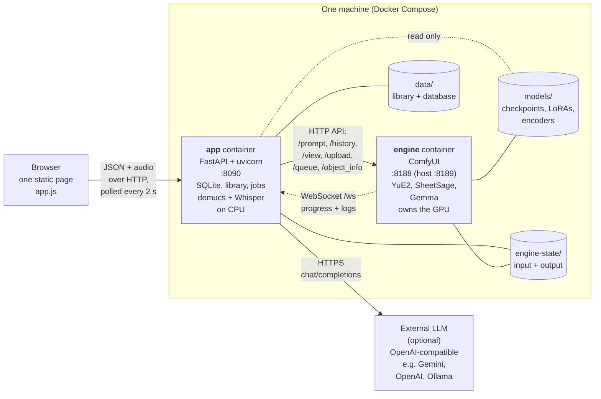
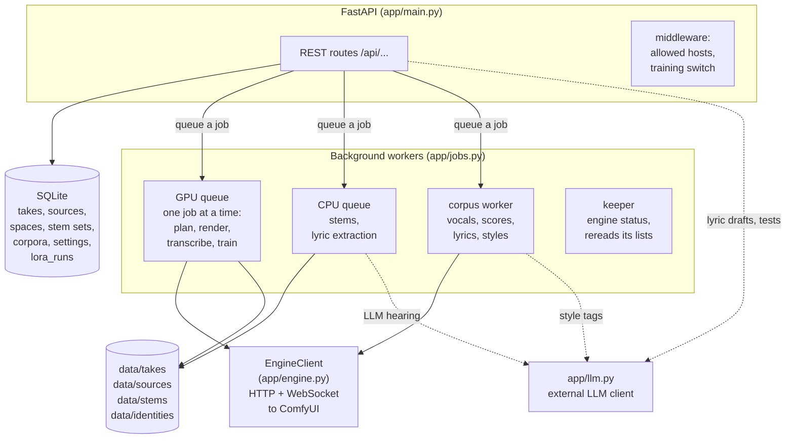
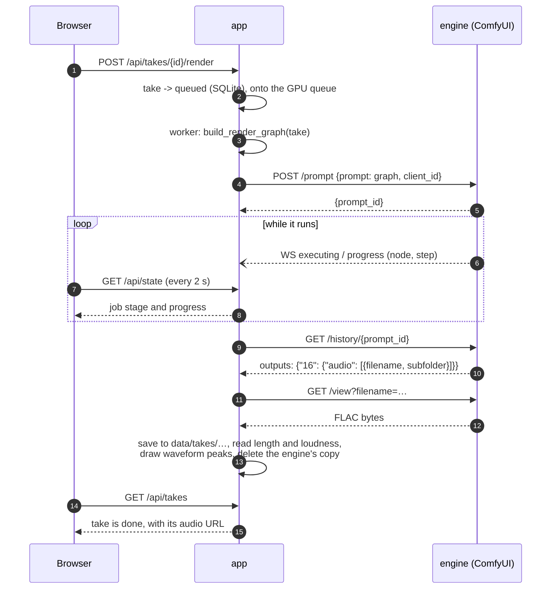
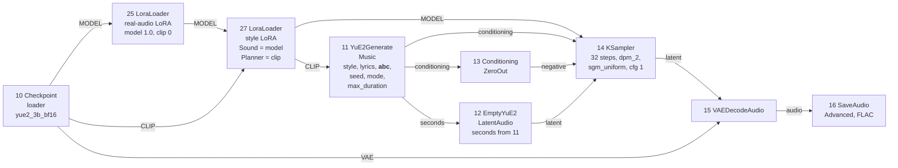
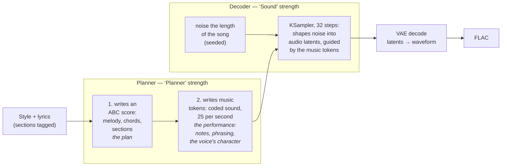
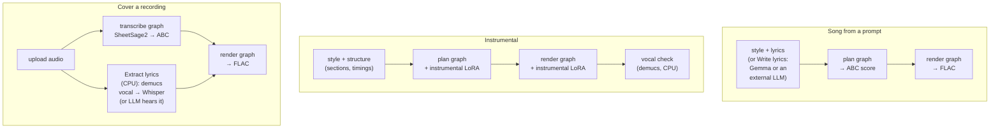
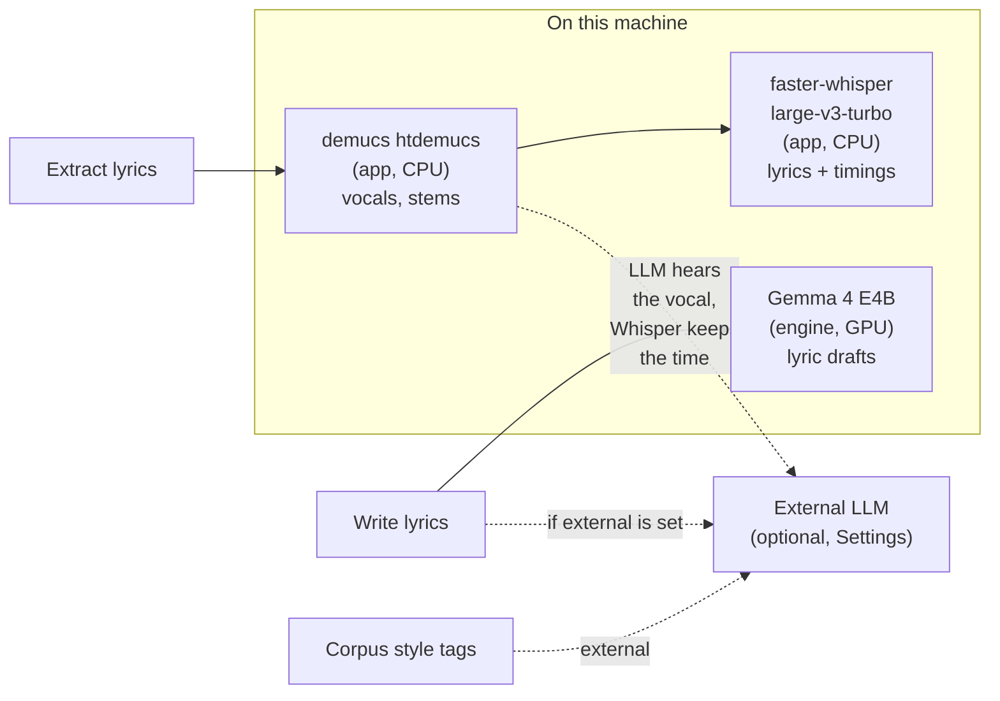
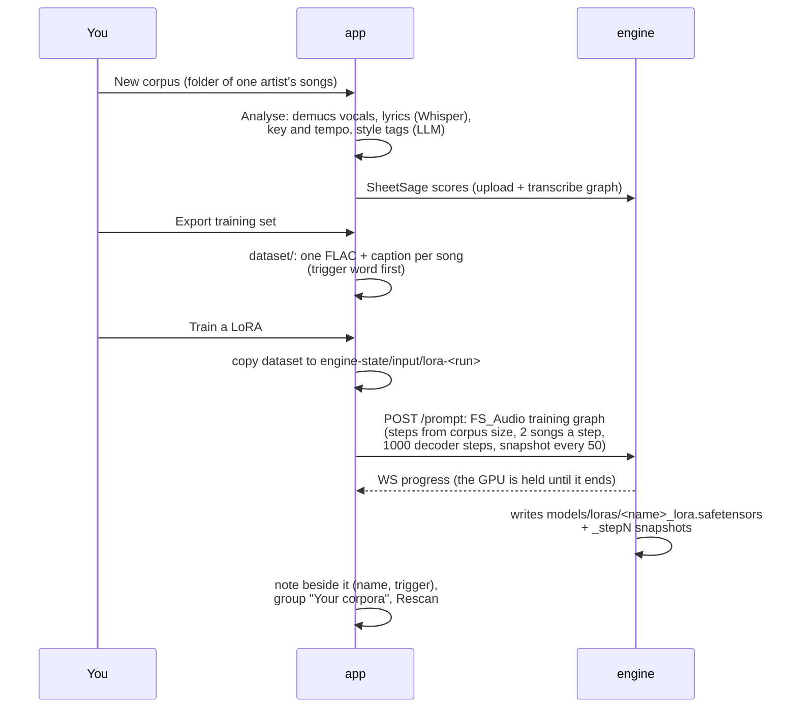

# Architecture

How YuE2 Studio is put together: the two containers, how the app drives ComfyUI, what YuE2 does
inside it, where the LLMs come in, and the API calls that tie it together. The diagrams are
[Mermaid](https://mermaid.js.org/), which GitHub draws in place.

- [The two containers](#the-two-containers)
- [Inside the app](#inside-the-app)
- [How the app talks to the engine](#how-the-app-talks-to-the-engine)
- [How ComfyUI is controlled: graphs](#how-comfyui-is-controlled-graphs)
- [How YuE2 makes a song](#how-yue2-makes-a-song)
- [LoRAs: where each one attaches](#loras-where-each-one-attaches)
- [The three workflows end to end](#the-three-workflows-end-to-end)
- [LLMs, Whisper and demucs](#llms-whisper-and-demucs)
- [Training a LoRA from a corpus](#training-a-lora-from-a-corpus)
- [The app's API, with examples](#the-apps-api-with-examples)
- [What lives where on disk](#what-lives-where-on-disk)

---

## The two containers



- **app** is the whole user-facing product: the web page, the REST API, the library (SQLite plus
  audio files), every job queue, and the CPU work that does not need the GPU (stem separation with
  demucs, lyric transcription with faster-whisper). It never loads YuE2 itself.
- **engine** is stock ComfyUI with the YuE2 nodes, the app's `yue2_harmony` node and, by default,
  the FS_Audio trainer node pack. It owns the GPU and does all the model work.
- They share two folders: `engine-state/input` (audio and training sets handed to the engine)
  and `engine-state/output` (renders the engine saves, which the app fetches and then deletes).
- The engine is published on `localhost:8189` for debugging and for opening ComfyUI's own
  interface; the app reaches it as `http://engine:8188` on the Compose network.

## Inside the app



The **GPU queue** runs one engine job at a time, because YuE2 needs most of the card's memory:
a render started on top of training would fail, so the app refuses to start one. The **CPU queue**
runs alongside it, so a stem split or a lyric extraction never waits for a render. Every job's
state lives in SQLite, so a restart puts waiting jobs back in their queues (a job that was running
is marked "interrupted by a restart").

The page is one static HTML file plus `app.js`. It polls `/api/state` every two seconds (engine
status, queue, current job progress, options such as the LoRA list) and `/api/takes` every three to
six, and repaints from what comes back.

## How the app talks to the engine

The app uses ComfyUI's own HTTP API, the same one ComfyUI's web interface uses.

| ComfyUI endpoint | Used for |
|---|---|
| `GET /object_info` | what nodes, checkpoints, LoRAs and encoders the engine has; read at start and every five minutes (**Rescan** forces it) |
| `POST /upload/image` | hand the engine a recording to transcribe, or a clip to describe (the name is ComfyUI's; it takes any file) |
| `POST /prompt` | submit a job: a graph of nodes, returns a `prompt_id` |
| `WS /ws?clientId=…` | progress: which node is running, sampler steps, the engine's log lines |
| `GET /history/{prompt_id}` | the finished job's outputs: ABC text, or the saved audio file's name |
| `GET /view?filename=…` | download a saved render |
| `GET /queue`, `POST /queue` `{"delete": […]}`, `POST /interrupt` | see what is waiting, cancel, stop |
| `GET /system_stats` | GPU name and free VRAM for the header pill |

A render, from the button to the file:



## How ComfyUI is controlled: graphs

Every engine job is a **graph**: a JSON object of numbered nodes, each with a `class_type` and
`inputs`, where an input is either a value or a link `["node id", output index]`. The app keeps
three templates in `app/templates/` and fills them in per take in `app/jobs.py`.

| Template | Nodes | Built by |
|---|---|---|
| `song_plan.json` | `CheckpointLoaderSimple` → `YuE2GenerateABC` → `PreviewAny` | `build_plan_graph` |
| `render.json` | `CheckpointLoaderSimple` → `YuE2GenerateMusic` → `EmptyYuE2LatentAudio` + `ConditioningZeroOut` → `KSampler` → `VAEDecodeAudio` → `SaveAudioAdvanced` | `build_render_graph` |
| `transcribe.json` | `LoadAudio` + `AudioEncoderLoader` (SheetSage2) → `SheetSage2AudioToABC` → `PreviewAny` | `build_transcribe_graph` |

Graphs made in code: lyric drafts (`CLIPLoader` for Gemma → `TextGenerate` → `PreviewAny`) and
training (`FSAudioLoraLoader` → `FSAudioModelLoader` → `FSAudioDatasetBuilder` +
`FSAudioRegularizer` → `FSAudioArtistTrainer`).

The render graph as it goes to the engine for a song with the real-audio LoRA and a style LoRA
(node ids as the app uses them):



A trimmed example of what `POST /prompt` receives for a plan (the whole body is
`{"prompt": <graph>, "client_id": "<the app's id>"}`):

```json
{
  "1":  {"class_type": "CheckpointLoaderSimple", "inputs": {"ckpt_name": "yue2_3b_bf16.safetensors"}},
  "21": {"class_type": "LoraLoader", "inputs": {
          "model": ["1", 0], "clip": ["1", 1], "lora_name": "paul_mccartney_lora.safetensors",
          "strength_model": 0.0, "strength_clip": 0.7}},
  "2":  {"class_type": "YuE2GenerateABC", "inputs": {
          "clip": ["21", 1], "style": "paulmccartney, folk, acoustic guitar, …, male vocal",
          "lyrics": "[verse]\n…", "seed": 1747519420, "mode": "full",
          "temperature": 0.5, "repetition_penalty": 1.02, "max_abc_tokens": 8192}},
  "3":  {"class_type": "PreviewAny", "inputs": {"source": ["2", 0]}}
}
```

`PreviewAny` is only there to give ComfyUI an output node; the ABC comes back through
`/history/{prompt_id}`. When the Harmony slider is off Familiar, node 2 becomes the app's own
`YuE2GenerateABCHarmony` (from `engine/custom_nodes/yue2_harmony`), which nudges the planner away
from chords it has just used.

## How YuE2 makes a song

YuE2 is two models in one checkpoint. The **planner** is a language model (it lives under
`text_encoders.` in the file, which is why ComfyUI treats it as a "clip"): it writes the song as
text. The **decoder** is a diffusion model (under `diffusion_model.`): it turns what the planner
wrote into audio.



What that means in the app:

- **Write score plan** runs step 1 only (the plan graph). The score lands in the editor, where
  you can change it before spending a render on it.
- **Render** runs step 2 and the decoder (the render graph), taking the score as fixed. The
  same score and seed give the same take.
- A **cover** skips step 1: SheetSage transcribes your recording into ABC, and that is the score.
- **Mode** `full` hands the planner melody and chords; `melody` hands it the melody only and lets
  the accompaniment be written freely.
- **Seed** drives both the music tokens and the decoder's noise. **Sing again** keeps the score
  and draws a new seed: a new performance of the same song, usually in a similar voice when a
  style LoRA sets it.
- **Length cap** sets the music-token budget. Changing it can re-sing the song even with the same
  seed: the planner's memory is sized to the budget, and its choices shift from the start.
- **Interpretation** changes how loosely step 2 samples (temperature, top-p, top-k, repetition
  penalty); **Plan variety** does the same for step 1.

## LoRAs: where each one attaches

A LoRA file can hold a planner half, a decoder half, or both. ComfyUI's `LoraLoader` applies them
through two strengths: `strength_clip` reaches the planner, `strength_model` the decoder. In the
app these are **Planner** and **Sound**.

| LoRA | Half | Applied |
|---|---|---|
| Real-audio (`nar_lora_joint_v9`) | decoder | Sound 1.0 on every render when *Production polish* is on |
| Instrumental (`ar_lora_inst_v3abc`) | planner | on the plan and the render of an instrumental, strength from *Feel* |
| Style LoRA (picked in the form) | usually both | plan: Planner only (there is no audio yet); render: both |

LoRAs chain: each `LoraLoader` takes the model and clip from the one before, so the real-audio,
instrumental and style LoRAs stack. What each half does, as measured on the LoRAs trained here:
the planner half carries the writing and the pronunciation (accent, phrasing), the decoder half
the recorded sound of the corpus, production included.

## The three workflows end to end



## LLMs, Whisper and demucs



- **Lyric drafts** go to Gemma through the engine by default, or to the external LLM when one is
  set up in Settings.
- **Extract lyrics** separates the vocal with demucs (kept beside the recording, so a second run
  skips it) and transcribes it with Whisper on the CPU. With the LLM option on and a model that
  accepts audio, the vocal is sent to the LLM as MP3 and Whisper supplies the timings; a reply
  that is not the whole song falls back to Whisper.
- **Style tags** for a corpus song come from the external LLM.

The external LLM is any **OpenAI-compatible** chat-completions endpoint. A lyric request:

```http
POST {api_url}/chat/completions
Authorization: Bearer <key>
Content-Type: application/json

{"model": "gemini-flash-latest",
 "messages": [{"role": "user", "content": "Write song lyrics about …"}],
 "temperature": 0.7}
```

Hearing a vocal adds the audio as a content part:

```json
{"model": "gemini-flash-latest", "temperature": 0,
 "messages": [{"role": "user", "content": [
   {"type": "text", "text": "Write down the words this vocal sings …"},
   {"type": "input_audio", "input_audio": {"data": "<base64 MP3>", "format": "mp3"}}
 ]}]}
```

## Training a LoRA from a corpus



## The app's API, with examples

Everything the page does goes through these routes; they return JSON unless noted. All examples
assume `http://localhost:8090`.

| Area | Routes |
|---|---|
| Status | `GET /api/state` (engine, queue, options, LoRA list), `GET /api/health`, `GET /api/logs` |
| Recordings | `POST /api/sources` (upload), `POST /api/sources/{id}/transcribe`, `PUT /api/sources/{id}/score`, `POST/GET/DELETE /api/sources/{id}/lyrics`, `GET /api/sources/{id}/audio` |
| Takes | `GET /api/takes`, `POST /api/songs`, `POST /api/instrumentals`, `POST /api/takes` (cover), `POST /api/takes/{id}/render`, `…/replan`, `…/revoice` (Sing again), `…/variations`, `…/cancel`, `PUT /api/takes/{id}/score`, `GET /api/takes/{id}/audio` |
| Stems | `POST /api/takes/{id}/stems`, `GET /api/stem-sets`, `GET /api/stem-sets/{id}/zip` |
| LoRAs | `GET /api/loras/{name}/download`, `POST /api/loras/install`, `DELETE /api/loras/{name}`, `POST /api/engine/reload-options` |
| Corpora | `/api/identities/…` (create, analyse, export, train, install) |
| Lyrics drafts | `POST /api/lyrics`, `GET /api/lyrics/{id}` |
| Settings | `GET/PUT /api/settings`, `POST /api/settings/test-llm`, `POST /api/settings/llm-models` |

Write a song, with the plan rendered as soon as it is ready:

```bash
curl -s -X POST http://localhost:8090/api/songs -H 'Content-Type: application/json' -d '{
  "title": "Harbour light", "style": "folk, acoustic guitar, male vocal",
  "lyrics": "[verse]\nThe harbour light is burning low\n\n[chorus]\nCarry me home",
  "seed": 42, "max_duration": 120, "variety": "calm", "auto_render": true,
  "style_lora": "paul_mccartney_lora.safetensors", "style_lora_model": 0.7, "style_lora_clip": 0.7}'
# -> {"id": "8b4a…", "status": "queued", …}
```

Follow it, render it again in another interpretation, then sing it again with a new seed:

```bash
curl -s http://localhost:8090/api/takes/8b4a… | jq '{status, stage, duration}'
curl -s -X POST http://localhost:8090/api/takes/8b4a…/render \
     -H 'Content-Type: application/json' -d '{"interpretation": "loose"}'
curl -s -X POST http://localhost:8090/api/takes/8b4a…/revoice
curl -s -o take.flac http://localhost:8090/api/takes/8b4a…/audio
```

Cover a recording:

```bash
curl -s -F file=@mysong.flac -F title="My song" http://localhost:8090/api/sources   # -> {"id": "3fbe…"}
curl -s -X POST http://localhost:8090/api/sources/3fbe…/transcribe                  # score, on the GPU
curl -s -X POST http://localhost:8090/api/sources/3fbe…/lyrics                      # words, on the CPU
curl -s -X POST http://localhost:8090/api/takes -H 'Content-Type: application/json' \
     -d '{"source_id": "3fbe…", "style": "soul, piano, male vocal", "lyrics": "…"}'
```

Share a LoRA, and add one someone sent:

```bash
curl -s -o macca.zip http://localhost:8090/api/loras/paul_mccartney_lora.safetensors/download
curl -s -F file=@their_lora.zip http://localhost:8090/api/loras/install
```

The engine can be driven directly too, for debugging, on `localhost:8189` (ComfyUI's interface is
there as well): `curl -s localhost:8189/queue`, or `curl -s localhost:8189/history?max_items=5`
to see the last graphs the app sent.

## What lives where on disk

```
data/
  yue2.sqlite            the library: takes, recordings, spaces, stems, corpora, settings
  takes/<title>-<id>/    each take's FLAC, its waveform peaks and a note of how it was made
  sources/               uploaded recordings, their separated vocal (<name>.vocals.flac)
  stems/                 stem sets
  identities/<id>/       a corpus: songs, vocals, lyrics, the exported dataset/
  models/whisper/        Whisper's weights, cached on first use
models/                  (read by the engine; the app reads it and writes only loras/)
  checkpoints/           yue2_3b_bf16.safetensors
  loras/                 real-audio, instrumental, style LoRAs, their .txt notes, families.txt
  text_encoders/         Gemma 4 E4B for lyric drafts
  audio_encoders/        SheetSage2 for transcription
engine-state/
  input/                 files handed to the engine, training sets
  output/                renders the engine saves before the app fetches them
```
